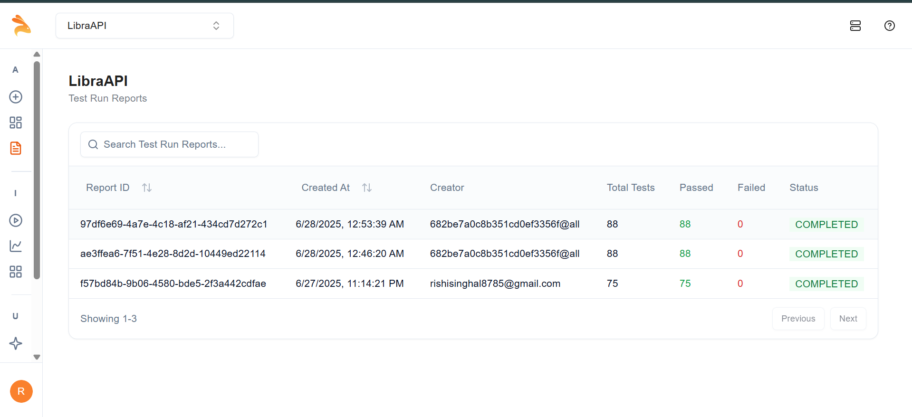

📚 Book Library API
Log, manage, and explore your personal digital library with a modern full-stack app. Built with Express.js, MongoDB, and React — featuring a beautiful UI, robust RESTful API, and automated quality assurance.

![CI](https://img.shields.io/github/actions/workflow/status/keshrishi/book-library-api/keploy-ci.yml?branch=main&label=CI%2FCD](https://img.shields.io/badge/coverage-86.66%25-bright](https://img.shields.io/badge/license-MIT-blue?style Features

➕ Add, 📖 view, ✏️ edit, and 🗑️ delete books in your library

Book fields: title, author, genre, publishedYear, rating

🎨 Responsive React + Tailwind CSS frontend

⚡ RESTful Express.js & MongoDB backend

🧪 Easy API testing with Postman, curl, Jest, and Supertest

🛠 Tech Stack
Frontend	Backend	Database	Testing
React, Tailwind	Node.js, Express, Mongoose	MongoDB	Jest, Supertest, Keploy, Postman, curl
🚀 Getting Started
1. Clone the Repository
bash
git clone https://github.com/keshrishi/book-library-api.git
cd book-library-api
2. Backend Setup
bash
cd backend
npm install
Create a .env file:

text
MONGO_URI=your_mongodb_connection_string
PORT=4000
Start MongoDB and the backend server:

bash
mongod
npm start
3. Frontend Setup
bash
cd ../frontend
npm install
npm start
📚 API Documentation
All API endpoints, sample requests, and responses are documented here:
👉 Book Library API – Postman Docs

🗂 Main API Endpoints
Endpoint	Method	Description
/api/books	GET	Get all books
/api/books	POST	Add a new book
/api/books/:id	PUT	Edit book info
/api/books/:id	DELETE	Remove a book
💡 Example Usage
Add a Book

bash
curl -X POST http://localhost:4000/api/books \
-H "Content-Type: application/json" \
-d '{"title":"Atomic Habits","author":"James Clear","genre":"Self-help","publishedYear":2018,"rating":4.6}'
Edit a Book

bash
curl -X PUT http://localhost:4000/api/books/<book_id> \
-H "Content-Type: application/json" \
-d '{"title":"Atomic Habits (Updated)","author":"James Clear","genre":"Self-help","publishedYear":2018,"rating":4.8}'
Delete a Book

bash
curl -X DELETE http://localhost:4000/api/books/<book_id>
🧪 Testing and Quality Assurance
Comprehensive automated and manual testing ensures reliability and maintainability.

Metric	Coverage
📄 Statements	86.66%
🌿 Branches	66.66%
🔧 Functions	100%
📏 Lines	86.66%
Run All Tests:

bash
cd backend
npm test
# Then open backend/coverage/lcov-report/index.html for detailed coverage.
🤖 Keploy AI-Powered API Testing & CI/CD
🚦 Automated test generation from OpenAPI schema and cURL commands

🟢 CI/CD Integration: All tests run on every commit via GitHub Actions

📝 Artifact retention for test reports

CI/CD Pipeline Status & Test Report:

## 🤖 Keploy API Test Report

Our API is continuously tested with [Keploy](https://keploy.io/) for reliability and zero regressions.

- All test runs are marked as **COMPLETED**.
- 88/88 and 75/75 tests passed in the latest runs.
- No failed tests across all recent executions.
🏆 Key Benefits
⚡ Zero-setup, AI-powered API testing

🤖 Self-healing test suites

🔄 Continuous validation for every code change

📊 Detailed reporting and regression protection

🖼️ Screenshots
Add screenshots of your app UI here if desired.

📄 License
MIT

🙏 Credits
Inspired by open source library management projects and the Keploy API Fellowship.

API documentation generated with Postman.

AI-powered testing by Keploy.

Happy reading and coding! 📚✨